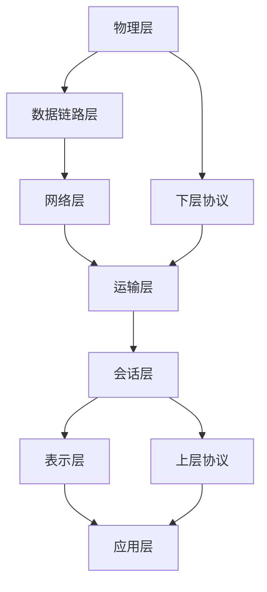

>#1.同一网段
>
>
>#2.开放系统互连参考模型 (Open System Interconnect 简称OSI）
>	 	OSI参考模型是计算机网路体系结构发展的产物。它的基本内容是开放系统通信功能的分层结构。这个模型把开放系统的通信功能划分为七个层次，从邻接物理媒体的层次开始，分别赋于1，2，……7层的顺序编号，相应地称之为物理层、数据链路层、网络层、运输层、会话层、表示层和应用层。每一层的功能是独立的。它利用其下一层提供的服务并为其上一层提供服务，而与其他层的具体实现无关。这里所谓的“服务”就是下一层向上一层提供的通信功能和层之间的会话规定，一般用通信原语实现。两个开放系统中的同等层之间的通信规则和约定称之为协议。通常把1～4层协议称为下层协议，5～7层协议称为上层协议
>
>
>物理层、数据链路层、网络层、传输层、会话层、表示层、应用层

>#3.ip分类 子网掩码 Nat
>		IP地址是一个32位二进制数的地址，理论上讲,2013 有大约60亿（2的32次方）个可能的地址组合，这似乎是一个很大的地址空间。实际上，根据网络ID和主机ID的不同位数规则，可以将IP地址分为A（8位网络ID和24位主机ID）、B（16位网络ID和16位主机ID）、C（24位网络ID和8位主机ID）三类
>	 A类网络缺省子网掩码：255.0.0.0/8
>	 B类网络缺省子网掩码：255.255.0.0/16
>	 C类网络缺省子网掩码：255.255.255.0/24
>
>
>
>#tcp/ip(三次握手) ARP

