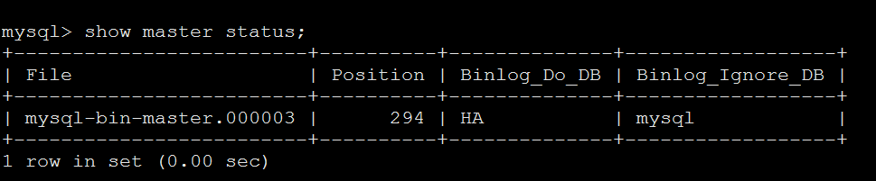
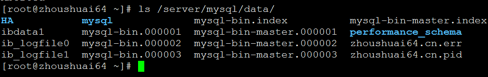
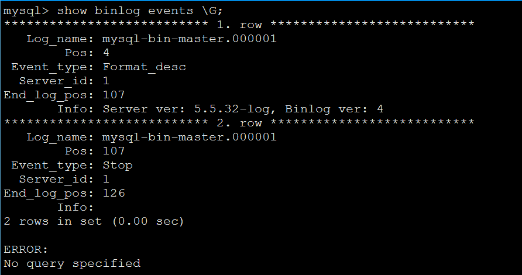
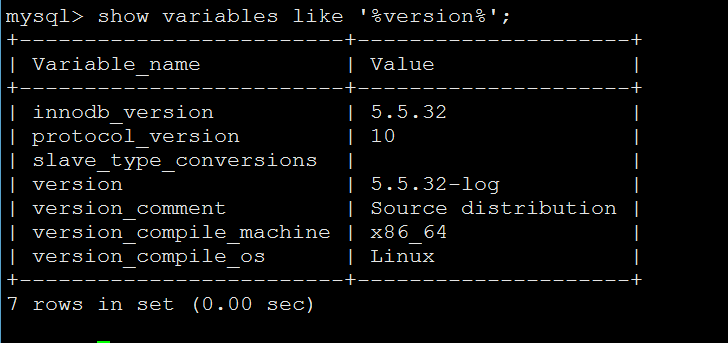
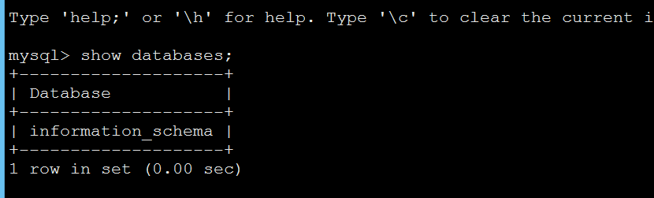
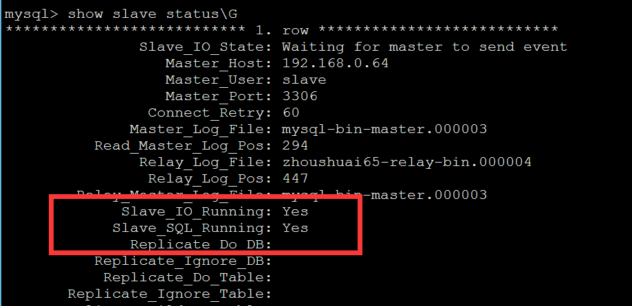
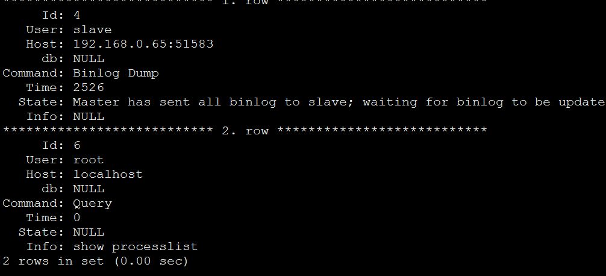
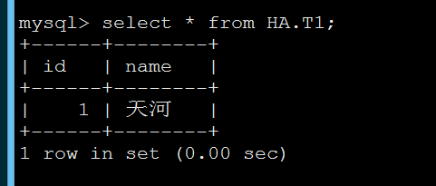

>#部署MYSQL主从同步
>##环境准备：
>| 主机名  |   IP   | 系统/MySQL版本 | 角色 |端口|模式|
>|--------|--------|---------------|------|---|---|
>|zhoushuai64| 192.168.0.64 | RHEL6.5/5.532 | Master |C/S|3306|
>|zhoushuai65| 192.168.0.65 | RHEL6.5/5.532 | Slave  |C/S|3306|
>#配置主数据库服务器zhoushuai64
>##创建需要同步的数据库：
>	 mysql> create database HA;
>	 mysql> use HA;
>	 mysql> create table T1(id int,name varchar(20));
>	 service mysqld stop
>##配置my.cnf:
>	 vim /etc/my.cnf
>	 log-bin=mysql-bin-master  #启用二进制日志
>	 server-id = 1   #本机数据库ID 标示
>	 binlog-do-db=HA #可以被从服务器复制的库。二进制需要同步的数据库名
>	 binlog-ignore-db=mysql  #不可以被从服务器复制的库
>##重启mysql:
>	 service mysqld restart
>##授权：
>	 mysql> grant replication slave on *.* to slave@192.168.0.65 identified by "123456";
>##查看状态信息
>	 mysql> show master status;
>	 
>| File                    | Position | Binlog_Do_DB | Binlog_Ignore_DB |
>|-------------------------|----------|--------------|------------------|
>| mysql-bin-master.000003 |      294 | HA           | mysql            |
>

>##查看二进制日志：
>	 ls /server/mysql/data/
>

>	 mysql> show binlog events\G
>	 

>##复制前要保证同步的数据库一致
>	 mysqldump  -uroot -p123456  HA >HA.sql  #也可以导出数据库
>##将导出的数据库传给从服务器
>	 方法一：scp HA.sql  192.168.0.65:/root
>	 方法二：使用nc命令
 
>#配置从数据库服务器zhoushuai65 
>##两台数据库服务器mysql版本要一致
>	 mysql> show variables like '%version%'; 
>	 

>##测试连接到主服务器是否成功
>	 mysql -uslave -p123456 -h 192.168.0.64
>	 

>####只有复制的权限
_________________________________________________
>##导入数据库，和主数据库服务器保持一致
>	 mysql> create database HA;
>	 mysql -usystem -p123456 HA<HA.sql
>##修改从服务器配置文件：
>##从服务器没必要开启bin-log日志
>	 service mysqld stop
>	 vim /etc/my.cnf
>	 server-id       = 2  #从服务器ID号，不要和主ID相同 ，如果设置多个从服务器，每个从服务器必须有一个唯一的server-id值，必须与主服务器的以及其它从服务器的不相同。可以认为server-id值类似于IP地址：这些ID值能唯一识别复制服务器群集中的每个服务器实例
>	 service mysqld start
>	 mysql> change master to master_host='192.168.0.64',master_user='slave',master_password='123456'; 
>	 mysql> start slave; 
>	 mysql> show slave status\G  查看状态
>

>####Slave_IO_Running ：一个负责与主机的io通信 connecting no
>####Slave_SQL_Running：负责自己的slave mysql进程
>##再到主服务器上查看状态：
>	 mysql> show processlist \G
>

>##插入数据测试同步
>	mysql> insert into T1 values(1,'天河');
>####从数据库上查看：
>

>##排错：
>####如果遇到主从不同步，看一下主从bin-log的位置，然后再同步
>

>##从服务器执行MySQL命令下：
>	 mysql> slave stop；             #先停止slave服务
>	 mysql> change master to master_log_file='mysqllog.000003' ,master_log_pos=294;  #根据上面主服务器的show master status的结果，进行从服务器的二进制数据库记录回归，达到同步的效果
>	 mysql>slave start;                      #启动从服务器同步服务
>	 mysql> show slave status\G;          #用show slave status\G;看一下从服务器的同步情况
>	 Slave_IO_Running: Yes
>	 Slave_SQL_Running: Yes
>	 如果都是yes，那代表已经在同步

>	 重启从服务器，再查看状态：
>	 停止从服务器slave stop;
>	 开启从服务器slave start;
>##排错思路：
>	 1、二进制日志没有开启
>	 2、IPTABLES 没有放开端口
>	 3、对应的主机 IP地址写错了
>##SQL线程出错
>	 1、主从服务器数据库结构不统一,出错后，数据少，可以手动解决创建插入，再更新slave状态。
#注：如果主上误删除了。那么从上也就误删除了。  #因此主上要定期做`mysqldump`备份。

