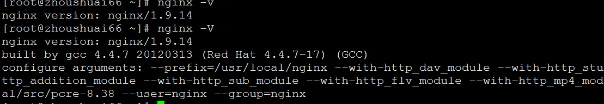
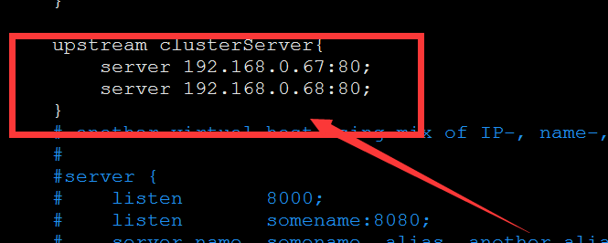

>#源码编译部署nginx-1.9.14
>###配置yum源
>RHEL系统本身光盘做成的yum源所提供的软件包有限，在实际使用过程中经常会出现缺包的现象，本文中CentOS源作为替代，CentOS的软件包和RHEL系统是互相兼容的，而且CentOS公司已被RHEL收购，所以不会出现兼容性的问题。
>>注：配置网络yum时，为了避免之前的yum文件相互冲突
>>建议删除之间的配置文件可直接执行 `rm -rf /etc/yum.repos.d/*`在执行相应配置
>
>####RHEL6.5
>	 本地yum源
>     [root@zhoushuai ~]# mount /dev/sr0  /mnt/
>     [root@zhoushuai ~]# echo "/dev/sr0 /mnt iso9660 defaults 0 0" >> /etc/fstab
>     [root@zhoushuai ~]# rm -rf /etc/yum.repos.d/*
>     [root@zhoushuai ~]# cat > /etc/yum.repos.d/rhel6.repo <<EOF
>     [rhel6-source]
>     name=rhel6-source
>     baseurl=file:///mnt
>     enabled=1
>     gpgcheck=0
>     EOF
>     [root@zhoushuai ~]# yum clean all
>     [root@zhoushuai ~]# yum list
_________________________________________________________________________
>	 配置网络yum源
>	  [root@zhoushuai ~]# wget -O /etc/yum.repos.d/CentOS6-Base-163.repo http://mirrors.163.com/.help/CentOS6-Base-163.repo
	 [root@zhoushuai ~]# sed -i 's/$releasever/6.8/g' /etc/yum.repos.d/CentOS6-Base-163.repo
	 [root@zhoushuai ~]# yum clean all
	 [root@zhoushuai ~]# yum list
	 [root@zhoushuai ~]# rpm -ivh /mnt/Packages/lrzsz-0.12.20-27.1.el6.x86_64.rpm
>###所需依赖包：
>	  [root@zhoushuai ~]# yum -y install gcc gcc-c++ autoconf automake
>	  [root@zhoushuai ~]# yum -y install zlib zlib-devel openssl openssl-devel
>	  Zlib：Nginx提供gzip模块，需要zlib的支持
>	  Openssl：Nginx提供SSL的功能
>###创建Nginx运行用户
>	 [root@zhoushuai ~]# useradd -M -s /sbin/nologin nginx
>###上传源码包
>	 [root@zhoushuai ~]# cd /usr/local/src/
>	 [root@zhoushuai src]# rz
>###安装
>	 [root@zhoushuai src]# unzip pcre-8.38.zip
>	 注：解压即可，不用安装，Nginx安装时指定pcre的解压路径即可
>	 [root@zhoushuai src]# tar zxf nginx-1.9.14.tar.gz
>	 [root@zhoushuai src]# cd nginx-1.9.14
>	 [root@zhoushuai nginx-1.9.14]# ./configure --prefix=/usr/local/nginx --with-http_dav_module --with-http_stub_status_module --with-http_addition_module --with-http_sub_module --with-http_flv_module --with-http_mp4_module --with-pcre=/usr/local/src/pcre-8.38 --user=nginx --group=nginx
>	 [root@zhoushuai nginx-1.9.14]# make -j 4 && make install
>	 [root@zhoushuai ~]# ll /usr/local/nginx/
>

>###配置Nginx
>	 [root@zhoushuai ~]# vim /usr/local/nginx/conf/nginx.conf
>	 改：
>

>	 为：
>

>###启动Nginx服务
>	 [root@zhoushuai ~]# /usr/local/nginx/sbin/nginx
>###优化Nginx启动命令执行路径
>	 [root@zhoushuai ~]# ln -s /usr/local/nginx/sbin/nginx  /usr/local/sbin/
>###生成服务启动脚本
>	 [root@zhoushuai ~]# vim /etc/init.d/nginx
>	 #!/bin/bash
>	 # chkconfig: - 99 2
>	 # description: Nginx Service Control Script
>	 PROG="/usr/local/nginx/sbin/nginx"
>	 PIDF="/usr/local/nginx/logs/nginx.pid"
>	 case "$1" in
>	         start)
>	         $PROG
>	         ;;
>	         stop)
>	         kill -3 $(cat $PIDF)
>	         ;;
>	         restart)
>	         $0 stop &> /dev/null
>	         if [ $? -ne 0 ] ; then continue ; fi
>	         $0 start
>	         ;;
>	         reload)
>	         kill -1 $(cat $PIDF)
>	         ;;
>	         *)
>	         echo "Userage: $0 { start | stop | restart | reload }"
>	         exit 1
>	 esac
>	 exit 0
>###配置服务开机自动启动
>	 [root@zhoushuai ~]# chmod +x /etc/init.d/nginx
>	 [root@zhoushuai ~]# chkconfig --add nginx
>	 [root@zhoushuai ~]# chkconfig nginx on
>	 [root@zhoushuai ~]# chkconfig --list nginx
>###安装成功

>###扩展：Nginx维护命令
>	 [root@zhoushuai ~]# nginx -t		#检查配置文件是否有语法错误
>	 nginx: the configuration file /server/nginx/conf/nginx.conf syntax is ok
>	 nginx: configuration file /server/nginx/conf/nginx.conf test is successful
>

>###查看Nginx配置参数
>	 [root@zhoushuai ~]# nginx -v/V
>	 [root@zhoushuai66 ~]# nginx -v
>	 nginx version: nginx/1.9.14
>	 [root@zhoushuai66 ~]# nginx -V
>	 nginx version: nginx/1.9.14
>	 built by gcc 4.4.7 20120313 (Red Hat 4.4.7-17) (GCC)
>	 configure arguments: --prefix=/usr/local/nginx --with-http_dav_module --with-http_stub_status_module --with-http_addition_module --with-http_sub_module --with-http_flv_module --with-http_mp4_module --with-pcre=/usr/local/src/pcre-8.38 --user=nginx --group=nginx
>

>#注：重新编译时，一定要查看以前的编译配置，只需在原有配置参数后添加新的参数即可
>#[root@zhoushuai ~]# nginx -s reload			#重载Nginx配置文件

>###【配置nginx动静分离】
>	 [root@zhoushuai ~]# cd /usr/local/nginx/conf/
>	 [root@zhoushuai conf]# cp nginx.conf{,.bak}
>	 [root@zhoushuai conf]# vim nginx.conf
>###【Nginx负载调度算法】
>	 1、加权轮询（weighted round robin）
>	 每个请求按时间顺序逐一分配到不同的后端服务器，如果后端服务器down掉，能自动剔除
>	 2、Weight
>	 指定轮询几率，Weight和访问比率成正比，用于后端服务器性能不均的情况
>	 3、ip_hash
>	 每个请求按访问ip的hash结果分配，这样每个访问固定访问一个后端服务器，可以解决session的问题
>	 4、fair（第三方）
>	 按后端服务器的响应时间来进行分配请求，响应时间短的优先分配
>	 5、通用hash、一致性hash
>	 这两种也是扩展策略，在具体的实现上有些差别，通用hash比较简单，可以以nginx内置的变量为key进行hash，一致性hash采用了nginx内置的一致性hash环，可以支持memcache
>

>#[root@zhoushuai ~]# nginx -s reload			#重载Nginx配置文件

