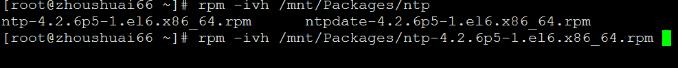
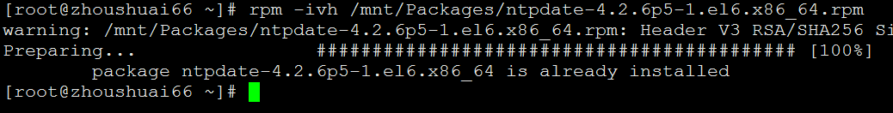
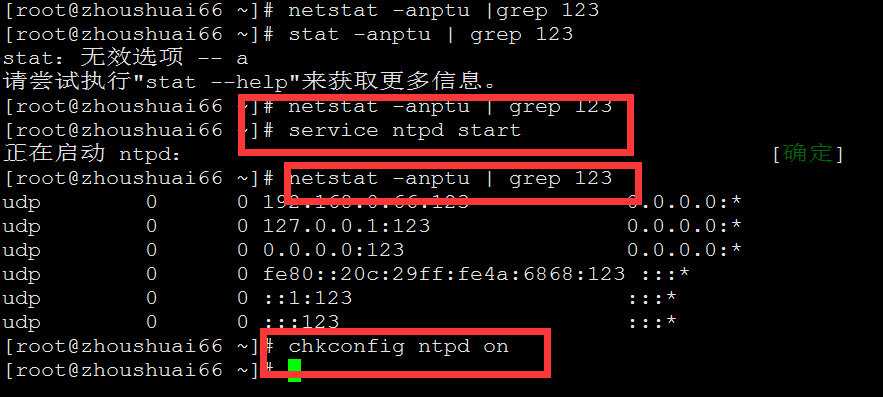

>#部署NTP服务器进行时间同步
>###配置yum源
>RHEL系统本身光盘做成的yum源所提供的软件包有限，在实际使用过程中经常会出现缺包的现象，本文中CentOS源作为替代，CentOS的软件包和RHEL系统是互相兼容的，而且CentOS公司已被RHEL收购，所以不会出现兼容性的问题。
>>注：配置网络yum时，为了避免之前的yum文件相互冲突
>>建议删除之间的配置文件可直接执行 `rm -rf /etc/yum.repos.d/*`在执行相应配置
>
>####RHEL6.5
>	 本地yum源
>     [root@zhoushuai ~]# mount /dev/sr0  /mnt/
>     [root@zhoushuai ~]# echo "/dev/sr0 /mnt iso9660 defaults 0 0" >> /etc/fstab
>     [root@zhoushuai ~]# rm -rf /etc/yum.repos.d/*
>     [root@zhoushuai ~]# cat > /etc/yum.repos.d/rhel6.repo <<EOF
>     [rhel6-source]
>     name=rhel6-source
>     baseurl=file:///mnt
>     enabled=1
>     gpgcheck=0
>     EOF
>     [root@zhoushuai ~]# yum clean all
>     [root@zhoushuai ~]# yum list
_________________________________________________________________________
>	  配置网络yum源
>	  [root@zhoushuai ~]# wget -O /etc/yum.repos.d/CentOS6-Base-163.repo http://mirrors.163.com/.help/CentOS6-Base-163.repo
>	  [root@zhoushuai ~]# sed -i 's/$releasever/6.8/g' /etc/yum.repos.d/CentOS6-Base-163.repo
>	  [root@zhoushuai ~]# yum clean all
>	  [root@zhoushuai ~]# yum list
>	  [root@zhoushuai ~]# rpm -ivh /mnt/Packages/lrzsz-0.12.20-27.1.el6.x86_64.rpm
>####安装NTP	  
>	  1、安装NTP服务端软件软件包
>	  [root@zhoushuai ~]# rpm -ivh /mnt/Packages/ntp-4.2.6p5-1.el6.x86_64.rpm
>	  或
>	  yum -y install ntp
>	  

>	  安装客户端：
>	  [root@zhoushuai Packages]# rpm -ivh /mnt/Packages/ntpdate-4.2.4p8-2.el6.x86_64.rpm

>	  配置文件位置
>	  [root@zhoushuai ~]# ls /etc/ntp.conf
>	  /etc/ntp.conf
>	  3、启动NTP服务
>	  先查看123端口是否开放：
>	  [root@zhoushuai ~]# netstat -anptu | grep 123
>	  

>	  [root@xuegod63 ~]# ntpstat			#列出是否与上游服务器连接。需要过5分钟
>	  synchronised to local net at stratum 11  #可以看到我们当前在11层。
>	     time correct to within 7948 ms	# ms毫秒是一种较为微小的时间单位，是一秒的千分之一。
>	     polling server every 64 s
  
>	  [root@xuegod63 ~]# ntpq -p		#:列出我们的NTP服务器与上游服务器的连接状态

>	  指令“ntpq -p”可以列出目前我们的NTP与相关的上层NTP的状态，以上的几个字段的意义如下： 
>	  remote：即remote - 本机和上层ntp的ip或主机名，“+”表示优先，“*”表示次优先。 
>	  refid：参考的上一层NTP主机的地址 
>	  st：即stratum阶层 
>	  poll：下次更新在几秒之后 
>	  offset：时间补偿的结果 

>	  客户同步时间：
>	  [root@xuegod64 ~]# ntpdate 192.168.1.63
>	  26 Mar 21:11:39 ntpdate[2955]: adjust time server 192.168.1.63 offset 0.000101 sec
>	  常见的错误： 
>	  25 Apr 15:30:17 ntpdate[11520]: no server suitable for synchronization found 
>	  其实，这不是一个错误。而是由于每次重启NTP服务器之后大约要3－5分钟客户端才能与server建立正常的通讯连接。当此时用客户端连接服务端就会报这样的信息。一般等待几分钟就可以了。 
>	  和NTP相关的配置文件：
>	  /etc/sysconfig/clock   #这个是 linux 的主要时区设定文件。每次开机后，Linux 会自动的读取这个文件来设定自己系统所默认要显示的时间。 
>	  [root@xuegod63 Desktop]# cat /etc/sysconfig/clock 
>	  # The time zone of the system is defined by the contents of /etc/localtime.
>	  # This file is only for evaluation by system-config-date, do not rely on its
>	  # contents elsewhere.
>	  ZONE="Asia/Shanghai"
>	  扩展：
>	  linux系统时间和BIOS时间是不是一定一样？
>	  查看硬件BIOS时间：
>	  hwclock -r    :读出BIOS的时间参数
>	  hwclock -w    :将当前系统时间写入BIOS中。
>	  [root@xuegod63 ~]# date -s "2016-3-27 22:00"
>	  2016年 03月 27日 星期日 22:00:00 CST
>	  [root@xuegod63 ~]# hwclock -r
>	  2016年03月26日 星期六 21时16分19秒  -1.172966 seconds
>	  [root@xuegod63 ~]# date
>	  [root@xuegod63 ~]# hwclock -w
>	  [root@xuegod63 ~]# hwclock -r
>	  2016年03月27日 星期日 22时00分33秒  -0.797470 seconds

>	  客户端配置：
>	  不同机器之间的时间同步 
>	  为了避免主机时间因为长期运作下所导致的时间偏差，进行时间同步(synchronize)的工作是非常必要的。

>	  同步时间，可以使用ntpdate命令，也可以使用ntpd服务。 
>	  方法一：使用ntpdate比较简单。格式如下： 
>	  [root@xuegod64 ~]# ntpdate 192.168.1.63
>	  27 Mar 22:02:27 ntpdate[44496]: step time server 192.168.1.63 offset 89029.272714 sec
>	  但这样的同步，只是强制性的将系统时间设置为ntp服务器时间。只是治标不治本。所以，一般配合cron命令，来进行定期同步设置。比如，在crontab中添加： 
>	  [root@xuegod64 ~]# crontab -e
>	  0 12 * * * /usr/sbin/ntpdate 192.168.1.63
>	  方法2：使用ntpd服务进行同步。
>	  要注意的是，ntpd 有一个自我保护设置: 如果本机与上源时间相差太大, ntpd 不运行. 所以新设置的时间服务器一定要先 ntpdate 从上源取得时间初值, 然后启动 ntpd服务。

