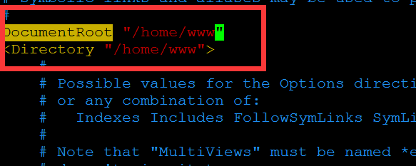
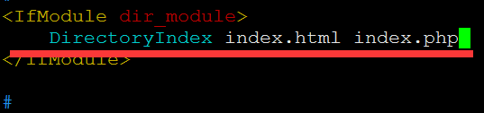

>#源码编译安装PHP-5.6.13
>###配置yum源
>RHEL系统本身光盘做成的yum源所提供的软件包有限，在实际使用过程中经常会出现缺包的现象，本文中CentOS源作为替代，CentOS的软件包和RHEL系统是互相兼容的，而且CentOS公司已被RHEL收购，所以不会出现兼容性的问题。
>>注：配置网络yum时，为了避免之前的yum文件相互冲突
>>建议删除之间的配置文件可直接执行 `rm -rf /etc/yum.repos.d/*`在执行相应配置
>
>####RHEL6.5
>	 本地yum源
>     [root@zhoushuai ~]# mount /dev/sr0  /mnt/
>     [root@zhoushuai ~]# echo "/dev/sr0 /mnt iso9660 defaults 0 0" >> /etc/fstab
>     [root@zhoushuai ~]# rm -rf /etc/yum.repos.d/*
>     [root@zhoushuai ~]# cat > /etc/yum.repos.d/rhel6.repo <<EOF
>     [rhel6-source]
>     name=rhel6-source
>     baseurl=file:///mnt
>     enabled=1
>     gpgcheck=0
>     EOF
>     [root@zhoushuai ~]# yum clean all
>     [root@zhoushuai ~]# yum list
_________________________________________________________________________
>	  配置网络yum源
>	  [root@zhoushuai ~]# wget -O /etc/yum.repos.d/CentOS6-Base-163.repo http://mirrors.163.com/.help/CentOS6-Base-163.repo
>	  [root@zhoushuai ~]# sed -i 's/$releasever/6.8/g' /etc/yum.repos.d/CentOS6-Base-163.repo
>	  [root@zhoushuai ~]# yum clean all
>	  [root@zhoushuai ~]# yum list
>	  [root@zhoushuai ~]# rpm -ivh /mnt/Packages/lrzsz-0.12.20-27.1.el6.x86_64.rpm
>###安装所需依赖包
>	  依赖包下载地址
>	  http://ftp.gnu.org/pub/gnu/libiconv/libiconv-1.14.tar.gz
>	  http://iweb.dl.sourceforge.net/project/mcrypt/Libmcrypt/2.5.8/libmcrypt-2.5.8.tar.gz
>	  http://hivelocity.dl.sourceforge.net/project/mhash/mhash/0.9.9.9/mhash-0.9.9.9.tar.bz2
>	  http://iweb.dl.sourceforge.net/project/mcrypt/MCrypt/2.6.8/mcrypt-2.6.8.tar.gz
>	  [root@zhoushuai ~]# yum -y install php-mcrypt libmcrypt libmcrypt-devel autoconf freetype gd libmcrypt libpng libpng-devel libjpeg libxml2 libxml2-devel zlib curl curl-devel
>###下载源码安装包
>	  [root@zhoushuai ~]# cd /usr/local/src/
>	  [root@zhoushuai src]# rz
>###libiconv库为需要做转换的应用提供了一个iconv()的函数，以实现一个字符编码到另一个字符编码的转换。 错误提示：configure: error: Please reinstall the iconv library.
>	  [root@zhoushuai src]# tar zxf libiconv-1.14.tar.gz 
>	  [root@zhoushuai src]# cd libiconv-1.14
>	  [root@zhoushuai libiconv-1.14]# ./configure --prefix=/usr/local/libiconv
>	  [root@zhoushuai libiconv-1.14]# make -j 4 && make install
>###libmcrypt是加密算法扩展库。 错误提示：configure: error: Cannot find imap library (libc-client.a). Please check your c-client installation.
>	  [root@zhoushuai src]# tar jxf libmcrypt-2.5.8.tar.bz2
>	  [root@zhoushuai src]# cd libmcrypt-2.5.8
>	  [root@zhoushuai libmcrypt-2.5.8]# ./configure
>	  [root@zhoushuai libmcrypt-2.5.8]# make -j 4 && make install
>###Mhash是基于离散数学原理的不可逆向的php加密方式扩展库，其在默认情况下不开启。 mhash的可以用于创建校验数值，消息摘要，消息认证码，以及无需原文的关键信息保存 错误提示：configure: error: “You need at least libmhash 0.8.15 to compile this program. http://mhash.sf.net/”
>	  [root@zhoushuai src]# tar zxf mhash-0.9.9.9.tar.gz 
>	  [root@zhoushuai src]# cd mhash-0.9.9.9
>	  [root@zhoushuai mhash-0.9.9.9]# ./configure 
>	  [root@zhoushuai mhash-0.9.9.9]# make -j 4 && make install
>###指定库文件路径
>	  [root@zhoushuai ~]# vim /etc/ld.so.conf
>	  include ld.so.conf.d/*.conf
>	  /usr/local/lib
>	  #/usr/local/mysql/lib/libmysqlclient.so.20
>	  [root@zhoushuai ~]# ldconfig
>###mcrypt 是 php 里面重要的加密支持扩展库，Mcrypt扩展库可以实现加密解密功能，就是既能将明文加密，也可以密文还原。
>	  [root@zhoushuai src]# tar zxf mcrypt-2.6.8.tar.gz 
>	  [root@zhoushuai src]# cd mcrypt-2.6.8
>	  [root@zhoushuai mcrypt-2.6.8]# ./configure
>	  [root@zhoushuai mcrypt-2.6.8]# make -j 4 && make install
>###pear按照一定的分类来管理pear应用代码库，你的pear代码可以组织到其中适当的目录中，其他人可以方便的检索并分享到你的成果；pear不仅仅是一个代码仓库，它同时也是一个标准，使用这个标准来书写你的php代码，将会增强你的程序的可读性，复用性，减少出错的几率；Pear通过两个类为你搭建了一个框架，实现了诸如析构函数，错误捕获功能，你通过继承就可以使用这些功能
>	  [root@zhoushuai ~]# yum -y install php-pear
>	  [root@zhoushuai ~]# yum install libjpeg-devel
>###安装ＰＨＰ
>	  [root@zhoushuai src]# tar jxf php-5.6.13.tar.bz2 
>	  [root@zhoushuai src]# cd php-5.6.13
>	  [root@zhoushuai php-5.6.13]# ./configure --prefix=/usr/local/php --with-apxs2=/usr/local/apache2/bin/apxs --with-config-file-path=/usr/local/php/etc/ --enable-fpm  --with-mysql=mysqlnd --with-mysqli=mysqlnd --with-pdo-mysql=mysqlnd --with-iconv-dir --with-freetype-dir --with-jpeg-dir --with-png-dir --with-zlib --with-libxml-dir=/usr --enable-xml --disable-rpath --enable-bcmath --enable-shmop --enable-sysvsem --enable-inline-optimization --with-curl --enable-mbregex --enable-mbstring --with-mcrypt --enable-ftp --with-gd --enable-gd-native-ttf --with-openssl --with-mhash --enable-pcntl --enable-sockets --with-xmlrpc --enable-zip --enable-soap --without-pear --with-gettext --disable-fileinfo --enable-maintainer-zts
>	  注：
>	  --with-apxs2                			#将php编译为Apache的一个模块进行使用
>	  --with-config-file-path     			#设置 php.ini 的搜索路径。默认为 PREFIX/lib
>	  --with-mysql                    	#mysql安装目录，对mysql的支持
>	  --with-mysqli                  		#mysqli扩展技术不仅可以调用MySQL的存储过程、处理MySQL事务，而且还可以使访问数据库工作变得更加稳定。是一个数据库驱动
>	  --with-iconv-dir                		#种字符集间的转换
>	  --with-freetype-dir             		#打开对freetype字体库的支持 
>	  --with-jpeg-dir                 		#打开对jpeg图片的支持 
>	  --with-png-dir              		#打开对png图片的支持
>	  --with-zlib                        	#打开zlib库的支持,实现GZIP压缩输出      
>	  --with-libxml-dir=/usr  			#打开libxml2库的支持,libxml是一个用来解析XML文档的函数库
>	  --enable-xml                    	#支持xml文档
>	  --disable-rpath             		#关闭额外的运行库文件
>	  --enable-bcmath             		#打开图片大小调整,用到zabbix监控的时候用到了这个模块
>	  --enable-shmop              		#shmop共享内存操作函数，可以与c/c++通讯
>	  --enable-sysvsem  				#加上上面shmop，这样就使得你的PHP系统可以处理相关的IPC函数（活动在内核级别）。
>	  --enable-inline-optimization       	#优化线程
>	  --with-curl                     		#打开curl浏览工具的支持  
>	  --with-curlwrappers         		#运用curl工具打开url流 ，新版PHP5.6已弃用
>	  --enable-mbregex            		#支持多字节正则表达式
>	  --enable-fpm                    	#CGI方式安装的启动程序，PHP-FPM服务
>	  --enable-mbstring           		#多字节，字符串的支持
>	  --with-gd                      		#打开gd库的支持，是php处理图形的扩展库，GD库提供了一系列用来处理图片的API，使用GD库可以处理图片，或者生成图片。
>	  --enable-gd-native-ttf  			#支持TrueType字符串函数库
>	  --with-mhash                    	#支持mhash算法扩展
>	  --enable-pcntl              		#freeTDS需要用到的，pcntl扩展可以支持php的多线程操作
>	  --enable-sockets            		#打开 sockets 支持
>	  --with-xmlrpc                   	#打开xml-rpc的c语言
>	  --enable-zip                  	#打开对zip的支持
>	  --enable-soap               		#扩展库通过soap协议实现了客服端与服务器端的数据互操作
>	  --with-mcrypt                   	#mcrypt算法扩展 互操作
>	  [root@zhoushuai php-5.6.13]# make -j 4
>	  [root@zhoushuai php-5.6.13]# make install

>###生成配置文件
>	  [root@zhoushuai php-5.6.13]# cp php.ini-production /usr/local/php/etc/php.ini
 
>###添加Apache支持
>	  [root@zhoushuai php-5.6.13]# vim /usr/local/apache2/conf/httpd.conf
>	  Addtype application/x-httpd-php .php .phtml
 
>###创建首页文件
>	  [root@zhoushuai php-5.6.13]# cd /usr/local/apache2/htdocs/
>	  [root@zhoushuai htdocs]# vim a.php
>	  <?php
>	 	 phpinfo();
>	  ?>

>###重启服务
>	  service apachectl restart
>###更换网站根目录：
>	  mkdir /home/www
>	  chmod -R 755 /home/www
>

>

>###重启服务
>	  service apachectl restart

